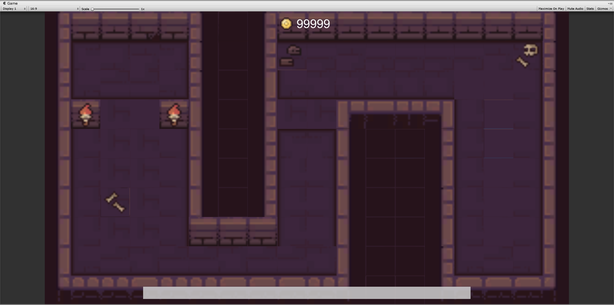

# Practice_2D_MapUI
 練習 - 2D 遊戲地圖編輯與遊戲介面

## 練習重點
1. 請先將此專案建立分支 (Fork)
2. 使用 GitHub 複製 (Clone) 專案至電腦
3. 使用 Unity Hub 開啟此專案內的 Unity 資料夾
4. 使用專案內的素材建立地城地圖如下圖

5. 請使用 TileMap 製作地圖
6. 建立遊戲介面包含
    - 金幣圖片
    - 金幣文字
    - 血條底部
    - 血條 (可以調整長度 Fill Mode)
7. 完成後請推送至 GitHub